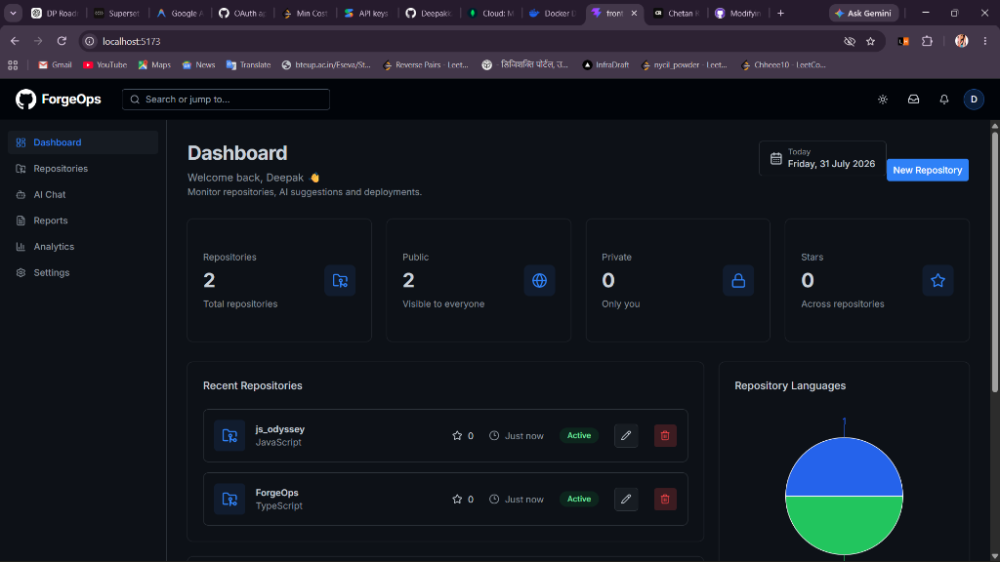
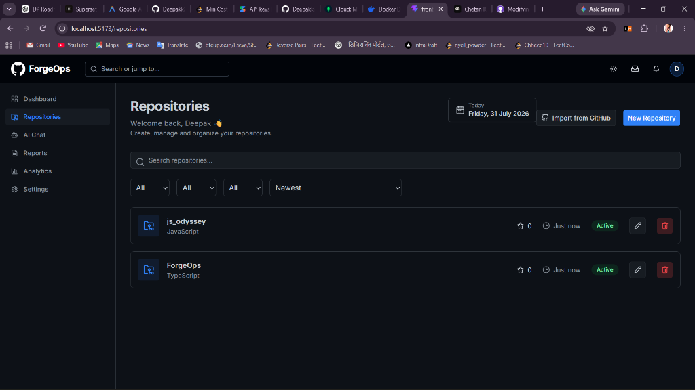
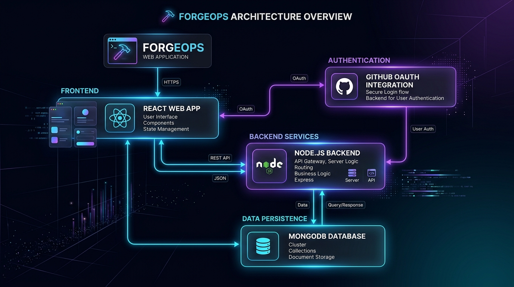
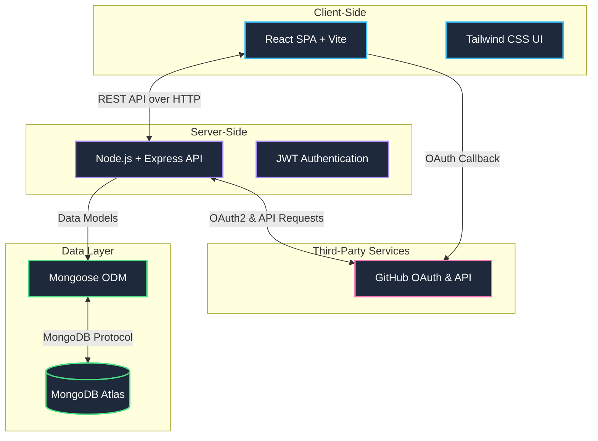
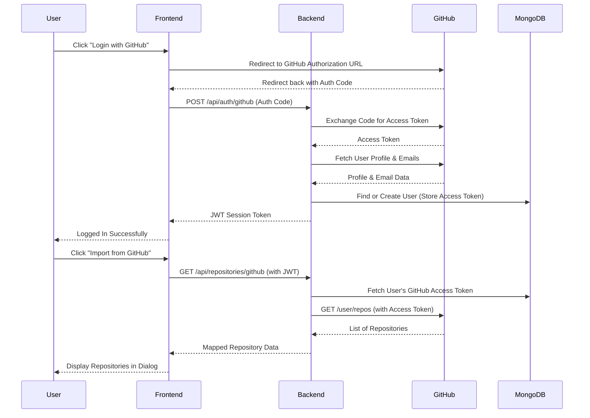

# ForgeOps — Intelligent DevOps Management Platform

A seamless, production-grade DevOps dashboard. Connect your repositories, track issues, review pull requests, and leverage integrated AI to analyze your codebase instantly — all from a beautiful, mobile-responsive interface.

ForgeOps is a robust full-stack application built on the **MERN** stack (MongoDB, Express, React, Node.js) and styled with **Tailwind CSS + Shadcn UI**. It features Dockerized microservices, security hardening, and an elegant dark-mode UI designed to rival modern premium SaaS platforms.

---

## Screenshots

### Main Dashboard

*The ForgeOps unified dashboard displaying active repositories, global metrics, and repository languages.*

### Repositories Management

*The repository view where users can import projects directly from GitHub and manage configurations.*

---

## Table of Contents
1. [Why ForgeOps](#why-forgeops)
2. [How ForgeOps Solves DevOps Management End-to-End](#how-forgeops-solves-devops-management-end-to-end)
3. [Architecture Overview](#architecture-overview)
4. [Module Deep-Dive](#module-deep-dive)
5. [Quickstart](#quickstart)
6. [Environment Variables](#environment-variables)
7. [Project Structure](#project-structure)
8. [Dependencies](#dependencies)

---

## Why ForgeOps

Every engineering team needs visibility. You can have the best CI/CD pipelines in the world, but if your developers cannot easily track pull requests, debug failing builds, and manage repository configurations in one unified place, productivity grinds to a halt.

ForgeOps is the observability and management spine for your engineering organization. 
- Every repository, branch, and commit is visualized.
- Every issue and pull request is tracked.
- **AI Integration:** An integrated Gemini-powered AI chat allows you to ask questions about your codebase directly from the repository view.
- **Security First:** The backend is hardened with HTTP header security (Helmet) and brute-force protection (Rate Limiting).

ForgeOps turns a scattered DevOps toolchain into a verifiable, debuggable engineering system.

---

## How ForgeOps Solves DevOps Management End-to-End

The brief demands a scalable, responsive, and secure platform that ships real results. Here is precisely how ForgeOps delivers:

- **Premium UI/UX.** Built with React, Vite, Tailwind CSS, and Shadcn UI. Features dynamic Skeleton loaders, premium empty states, fluid mobile navigation (hamburger sheets), and seamless dark/light mode switching.
- **Full-Stack Autonomy.** A decoupled Node.js/Express backend handles business logic, MongoDB persists state, and Nginx serves as a reverse proxy, tying it all together securely.
- **AI Codebase Analysis.** Integrated Google Gemini 2.0 API allows developers to chat with an AI assistant contextualized to their specific repository and pull requests.
- **Security & Stability.** The API is shielded by `helmet` and `express-rate-limit`. 
- **Production-Ready Dockerization.** The entire stack (Frontend, Backend, Proxy) is containerized via `docker-compose`. Deployment is a single command away.

---

## Architecture Overview



ForgeOps utilizes a standard 3-tier containerized architecture:

1. **Frontend (React + Vite + TypeScript)**
   - **Role:** The presentation layer.
   - **Tech:** React Router for SPA navigation, Tailwind + Shadcn for styling, Lucide React for iconography.
   
2. **Backend (Node.js + Express + TypeScript)**
   - **Role:** The API engine.
   - **Tech:** Express for routing, Mongoose for database modeling, JSON Web Tokens (JWT) for stateless authentication.
   
3. **Database (MongoDB Atlas)**
   - **Role:** Persistence layer.
   - **Tech:** NoSQL document storage for repositories, users, issues, and webhooks.

4. **Proxy (Nginx)**
   - **Role:** API Gateway & Static File Server.
   - **Tech:** Routes `/api` traffic to the Node backend and serves the compiled React static files on port `80`.

### High-Level Architecture Diagram



### GitHub OAuth & Repository Import Flow



---

## Module Deep-Dive

### 1. Dashboard & Analytics
The entry point. Aggregates data across all repositories, displaying recent commits, active issues, and pending pull requests. Features Skeleton loading states for smooth data fetching.

### 2. Repository Management
View all repositories, their default branches, and clone URLs. Drill down into specific repositories to view the file tree and commit history.

### 3. AI Chat Assistant
A dedicated interface hooked into Google's Gemini API. Ask questions like *"Explain how the authentication middleware works in this repo"* and receive context-aware answers.

### 4. Pull Requests & Issues
Track code reviews and bug reports. Features filtering, tagging, and status updates (Open, In Progress, Closed).

### 5. Settings & Profile
Manage user preferences, toggle dark mode, and handle secure logout flows.

---

## Quickstart

### Prerequisites
- Docker & Docker Compose installed
- Git

### 1. Clone and Configure
```bash
git clone https://github.com/your-org/forgeops.git
cd forgeops

# Copy environment templates
cp backend/.env.example backend/.env
cp frontend/.env.example frontend/.env
```

*Edit `backend/.env` and add your MongoDB URI and Gemini API Key.*

### 2. Build and Run via Docker Compose
```bash
# This will build the frontend, build the backend, and start Nginx
docker compose up --build -d
```

### 3. Access the Application
Open your browser and navigate to: `http://localhost`

---

## Environment Variables

### Backend (`backend/.env`)
```ini
PORT=5000
MONGO_URI=mongodb+srv://<username>:<password>@cluster0...
JWT_SECRET=your_super_secret_jwt_key
GEMINI_API_KEY=your_google_gemini_api_key
```

### Frontend (`frontend/.env`)
```ini
# Since Nginx proxies /api to the backend, relative paths work perfectly
VITE_API_URL=/api
```

---

## Project Structure

```text
ForgeOps/
├── docker-compose.yml       # Master container orchestration
├── frontend/                # React Vite SPA
│   ├── src/
│   │   ├── components/      # Reusable UI (Shadcn, layout)
│   │   ├── pages/           # Route views (Dashboard, Repo, Chat)
│   │   └── routes/          # React Router setup
│   ├── Dockerfile
│   └── nginx.conf           # Nginx reverse proxy configuration
├── backend/                 # Node.js Express API
│   ├── src/
│   │   ├── controllers/     # Route logic
│   │   ├── models/          # Mongoose schemas
│   │   ├── routes/          # Express routers
│   │   └── config/          # DB connections
│   └── Dockerfile
└── README.md
```

---

## Dependencies

### Frontend Core
- **React 18** / **Vite** / **TypeScript**
- **Tailwind CSS** / **Shadcn UI** / **Lucide React**
- **React Router DOM** (Navigation)
- **Next-Themes** (Dark Mode)

### Backend Core
- **Express 5** / **Node.js**
- **Mongoose** (MongoDB ORM)
- **@google/genai** (AI Integration)
- **Helmet** & **Express-Rate-Limit** (Security)
- **Bcrypt.js** & **JSONWebToken** (Auth)
